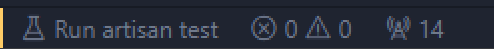
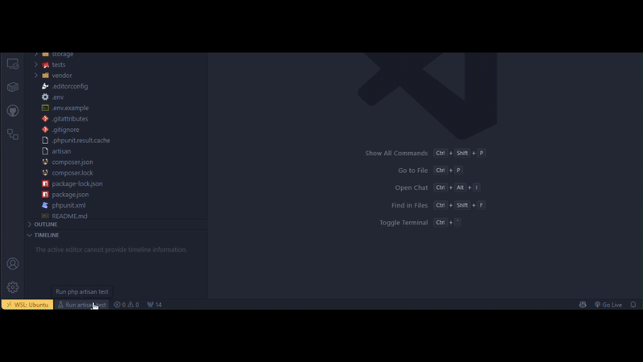
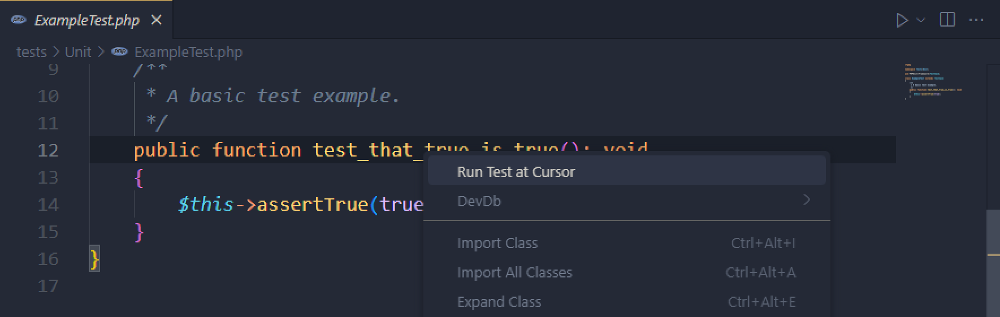

# Laravel Test Shortcuts

A VS Code extension that provides shortcuts for running Laravel tests, making it easier to execute tests directly from the editor.

## Features

- **Run Artisan Test**: Run all tests in the current project using a new status bar item.

- **Run Test at Cursor**: Execute the test at the current cursor position from the context menu.

### 0.0.1

Initial release including the `Run Artisan Test` and `Run Test at Cursor` features.

## Attributions

<a href="https://www.flaticon.com/free-icons/beaker" title="beaker icons">Beaker icons created by Freepik - Flaticon</a>